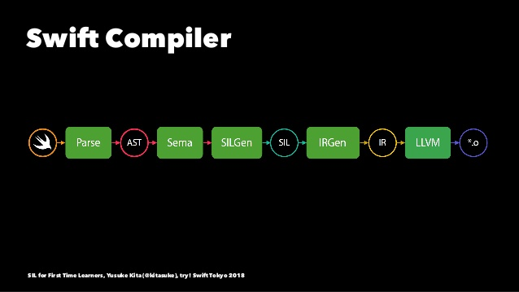
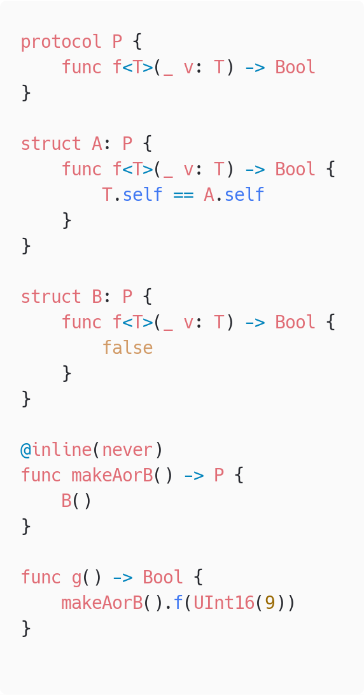
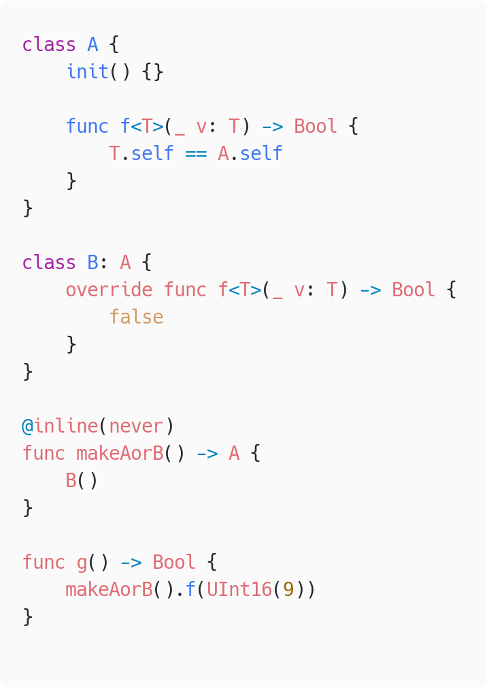

## わいわいswiftc #17

# SwiftのGenerics関数の特殊化

Twitter @iceman5499

<!-- _footer: 2020年1月17日 -->

---

## Generics関数の特殊化とは

- コンパイル時にgenerics関数に対し実際に使用される型パラメータを埋め込んで展開し、型ごとに専用の実装を生やす最適化

```swift
func f<T>(_ v: T) {}
f(1)
```

↓ 最適化としてIntをあらかじめ埋め込む

```swift
func f<T>(_ v: T) {}
func f(_ v: Int) {} // 最適化時に生成される関数
f(1)
```

---

## Generics関数の特殊化の利点

- Swiftのジェネリクスは実行時にいろいろなことをやるのでオーバーヘッドがある
    - 特殊化されているとそのいろいろを無視できるので速い
- 参考
    - C++のテンプレートやRustのジェネリクスはコンパイル時にすべて展開されるのでオーバーヘッドがない
    - ただし展開される数だけバイナリが太る

---

#### 特殊化が行われるタイミング



SILOptimizerのフェーズで行われる

<!-- _footer: (引用元: https://www.slideshare.net/kitasuke/sil-for-first-time-leaners/1 by kitasuke) -->

---

## 特殊化される様子を観察する

```swift
// generics.swift
struct A<T> {
  var value: T
}

@inline(never)
func f() -> UInt16 {
  let a = A(value: UInt16(6)) // ← これが特殊化される
  return a.value
}

f()
```

# <!-- fit --> $ swift -O -Xllvm -sil-print-all -Xllvm -sil-print-only-functions=s8generics1fs6UInt16VyF generics.swift

---

```
*** SIL module before Guaranteed Passes ***
// f()
sil hidden [noinline] [ossa] @$s8generics1fs6UInt16VyF : $@convention(thin) () -
> UInt16 {
bb0:
  %0 = alloc_stack $A<UInt16>                     // users: %13, %11, %9
  %1 = metatype $@thin A<UInt16>.Type             // user: %9
  %2 = integer_literal $Builtin.IntLiteral, 6     // user: %5
  %3 = metatype $@thin UInt16.Type                // user: %5
  // function_ref UInt16.init(_builtinIntegerLiteral:)
  %4 = function_ref @$ss6UInt16V22_builtinIntegerLiteralABBI_tcfC : $@convention
  (method) (Builtin.IntLiteral, @thin UInt16.Type) -> UInt16 // user: %5
  %5 = apply %4(%2, %3) : $@convention(method) (Builtin.IntLiteral, @thin UInt16
  .Type) -> UInt16 // user: %7
  %6 = alloc_stack $UInt16                        // users: %10, %9, %7
  store %5 to [trivial] %6 : $*UInt16             // id: %7
  // function_ref A.init(value:)
  %8 = function_ref @$s8generics1AV5valueACyxGx_tcfC : $@convention(method) <τ_0
  _0> (@in τ_0_0, @thin A<τ_0_0>.Type) -> @out A<τ_0_0> // user: %9
  %9 = apply %8<UInt16>(%0, %6, %1) : $@convention(method) <τ_0_0> (@in τ_0_0, @
  thin A<τ_0_0>.Type) -> @out A<τ_0_0>
  dealloc_stack %6 : $*UInt16                     // id: %10
  %11 = load [trivial] %0 : $*A<UInt16>           // users: %14, %12
  debug_value %11 : $A<UInt16>, let, name "a"     // id: %12
  dealloc_stack %0 : $*A<UInt16>                  // id: %13
  %14 = struct_extract %11 : $A<UInt16>, #A.value // user: %15
  return %14 : $UInt16                            // id: %15
} // end sil function '$s8generics1fs6UInt16VyF'
```

---

- 一番最初のフェーズではUInt16のメタタイプを渡して呼出

(↓前ページの一部を抜粋)

```
%8 = function_ref @$s8generics1AV5valueACyxGx_tcfC : $@convention(method) <τ_0_0
> (@in τ_0_0, @thin A<τ_0_0>.Type) -> @out A<τ_0_0> // user: %9
%9 = apply %8<UInt16>(%0, %6, %1) : $@convention(method) <τ_0_0> (@in τ_0_0, @th
in A<τ_0_0>.Type) -> @out A<τ_0_0>
```

```
$ swift demangle s8generics1AV5valueACyxGx_tcfC

$s8generics1AV5valueACyxGx_tcfC 
---> generics.A.init(value: A) -> generics.A<A>
```


---

```
  *** SIL function after  #69, stage HighLevel+EarlyLoopOpt, 
  pass 13: GenericSpecializer (generic-specializer)
// f()
sil hidden [noinline] @$s8generics1fs6UInt16VyF : $@convention(thin) () -> UInt16 {
bb0:
  %0 = alloc_stack $A<UInt16>                     // users: %9, %11, %13
  %1 = metatype $@thin A<UInt16>.Type             // user: %8
  %2 = integer_literal $Builtin.Int16, 6          // user: %3
  %3 = struct $UInt16 (%2 : $Builtin.Int16)       // user: %5
  %4 = alloc_stack $UInt16                        // users: %7, %5, %10
  store %3 to %4 : $*UInt16                       // id: %5
  // function_ref specialized A.init(value:)
  %6 = function_ref @$s8generics1AV5valueACyxGx_tcfCs6UInt16V_Tg5 : $@convention(me
  thod) (UInt16, @thin A<UInt16>.Type) -> A<UInt16> // user: %8
  %7 = load %4 : $*UInt16                         // user: %8
  %8 = apply %6(%7, %1) : $@convention(method) (UInt16, @thin A<UInt16>.Type) ->
   A<UInt16> // user: %9
  store %8 to %0 : $*A<UInt16>                    // id: %9
  dealloc_stack %4 : $*UInt16                     // id: %10
  %11 = struct_element_addr %0 : $*A<UInt16>, #A.value // user: %12
  %12 = load %11 : $*UInt16                       // user: %14
  dealloc_stack %0 : $*A<UInt16>                  // id: %13
  return %12 : $UInt16                            // id: %14
} // end sil function '$s8generics1fs6UInt16VyF'
```

---

- GenericSpecializerを通過すると特殊化された実装が生える

```
// function_ref specialized A.init(value:)
%6 = function_ref @$s8generics1AV5valueACyxGx_tcfCs6UInt16V_Tg5
 : $@convention(method) (UInt16, @thin A<UInt16>.Type) -> 
 A<UInt16> // user: %8
%7 = load %4 : $*UInt16                         // user: %8
%8 = apply %6(%7, %1) : $@convention(method) (UInt16, @thin 
A<UInt16>.Type) -> A<UInt16> // user: %9
  store %8 to %0 : $*A<UInt16>                    // id: %9
```

```
$ swift demangle s8generics1AV5valueACyxGx_tcfCs6UInt16V_Tg5

$s8generics1AV5valueACyxGx_tcfCs6UInt16V_Tg5 
---> generic specialization <Swift.UInt16> of
 generics.A.init(value: A) -> generics.A<A>
```

---


```
  *** SIL module after #2, stage IRGen Preparation, pass 1: 
  LoadableByAddress (loadable-address)
// f()
sil hidden [noinline] @$s8generics1fs6UInt16VyF : $@conventi
on(thin) () -> UInt16 {
bb0:
  %0 = integer_literal $Builtin.Int16, 6          // user: %1
  %1 = struct $UInt16 (%0 : $Builtin.Int16)       // user: %2
  return %1 : $UInt16                             // id: %2
} // end sil function '$s8generics1fs6UInt16VyF'
```

- 最終的には全部消える

---

### fを観察した結果

最初はそのまま呼び出されていた`A<T>.init(_:)`が

↓

`A<UInt16>.init(_:)` に特殊化され

↓

さらにインライン化されて消えた


---

### 特殊化されたA<UInt16>.initができてから消える様子

`$ swift -O -Xllvm -sil-print-all -Xllvm -sil-print-only-functions=s8generics1AV5valueACyxGx_tcfCs6UInt16V_Tg5 generics.swift`

- 途中から生えて最後には無くなってる様子が確認できる

---

# 具体的なSILOptimizerにおける最適化プロセス


このへんで行われてる
- GenericSpecializer.cpp
- Generics.cpp

---

## 特殊化の流れ

1. 型パラつきの`apply`命令を集める
1. 特殊化できないものを除外する
1. 集めた`apply`ごとに特殊化
    - ここでも精査され特殊化に失敗しうる
1. 特殊化に成功した`apply`の呼び出し先を新しい関数に置き換えて、既存の呼び出しを削除

---

## 特殊化できない呼び出し①

いろいろな条件がある

- 呼び出し先の実装が参照不可能（外部モジュールなど）
- アノテーションがついてる 
- dynamicがついてる

```swift
@_semantics(optimize.sil.specialize.generic.never)
func f<T>() {}
```

```swift
dynamic func f<T>() {}
```

---

## 特殊化できない呼び出し②

- archetype（実行時に決まる型）がある
  - 特殊化の過程でarchetypeがすべて潰されると最適化できるようになることがある
- 型が複雑すぎる
  - 型パラがネストを含め50個以上ある
  - NTDの要素が2000個以上ある
  - 要素2000個以上のタプル
  - 引数2000個以上のクロージャ

---

#### archetype（実行時に決まる型）があって失敗する例

 　　 

---

#### archetype（実行時に決まる型）があって失敗する例

- protocolのほう（前ページ左）は特殊化に失敗する
- classのほう（前ページ右）は特殊化に成功する
  - 事前にdevirtualizeが適用されてよりシンプルなコードになっているため

```swift
// 特殊化までにこのようなコードに変形されている
func g() -> Bool {
    let result = makeAorB()
    if let a = result as? A {
        return a.f(UInt16(9))
    } else let b = result as? B {
        return b.f(UInt16(9))
    } else {
        return result.f(UInt16(9))
    }
}
```

---

#### 型が複雑すぎる

```swift
struct A<T> {
    var v: T
    init(_ v: T) { self.v = v }
}

func use<T>(_ v: T) -> T {
    v
}

let a49 = A(A(A(A(A(A(A(A(A(A(A(A(A(A(A(A(A(A(A(A(
          A(A(A(A(A(A(A(A(A(A(A(A(A(A(A(A(A(A(A(A(
          A(A(A(A(A(A(A(A(A(Int16(9)))))))))))))))
          )))))))))))))))))))))))))))))))))))
let a50 = A(a49)

use(a49) // ← 特殊化される
use(a50) // ← されない
```

---


## 特殊化できない呼び出し③

- 特殊化の無限ループが起こるとき
  - どういう状況でそうなるかわからなかった

--- 

# 型自体の特殊化は行われない

`struct A<T> {}` に対して `struct A_Int {}` みたいな型パラ埋め込み済みの型は生成されない
<br>
- `GenericSpecializer`は`apply`命令にしか処理を行わない
- 他に特殊化を行ってる箇所がなさそう、実際のSILを見てもそれっぽい動きがなさそう
- そもそも型自体を特殊化するメリットはほとんど無いのかも？意見募集

---

#### おまけ:
# @_specializeによる特殊化

- @_specializeをつけると型を指定して特殊化できる
- 内部で型による分岐が走る特殊化が行われる

```swift
// @_specialize(where T == Int)
func f<T: CustomStringConvertible>(_ v: T) -> String {
    v.description
}
```

---

特殊化後のコードのイメージ

```swift
// @_specialize(where T == Int)
func f<T: CustomStringConvertible>(_ v: T) -> String {
    if let v = v as? Int {
        return v.description
    } else {
        return v.description
    }
}
```

- 同じ `.description` 呼び出しだが後者はwitness tableの参照を行うのでオーバーヘッドがある

---