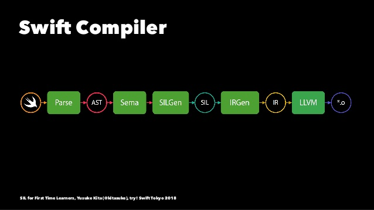
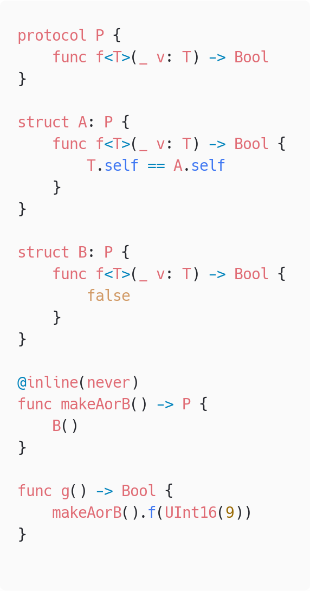
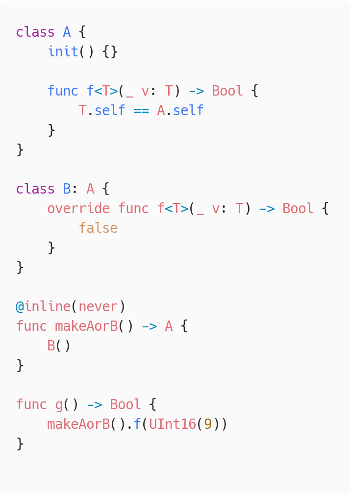

## わいわいswiftc #19

# SwiftのGenerics関数の特殊化

Twitter @iceman5499

<!-- _footer: 2020年4月20日 -->

---

## Generics関数の特殊化とは

- 実際に使用される型パラメータをコンパイル時に埋め込んで展開し、その型専用の実装を生やす最適化

```swift
func f<T>(_ v: T) {}
f(Int(1))
```

↓ Intをあらかじめ埋め込む

```swift
func f<T>(_ v: T) {}
func f(_ v: Int) {} // Intに特殊化された関数
f(Int(1))
```

---

## Generics関数の特殊化の利点

- Swiftのジェネリクスは実行時にいろいろなことをやるのでオーバーヘッドがある
    - 特殊化されているとそのいろいろを無視できるので速い
- いろいろの例
    - メタタイプの取り出し
    - witness table経由での関数の呼び出し

<!-- C++のテンプレートやRustのジェネリクスはコンパイル時にすべて展開されるのでオーバーヘッドがない。ただし展開される数だけバイナリが太る -->
<!-- _footer: swiftc p3.swift -emit-sil | code -  -->

---

#### 特殊化が行われるタイミング



SILOptimizerのフェーズで行われる

<!-- _footer: (引用元: https://www.slideshare.net/kitasuke/sil-for-first-time-leaners/1 by kitasuke) -->

---

# 特殊化される様子を観察する

```swift
func f<T>(_ v: T) -> T { v }

@inline(never)
func g() -> UInt16 {
  f(UInt16(5)) // ← これが特殊化される
}

g()
```

このコードをコンパイルしてみて、最適化前と最適化後で `g` 関数のSILの変化を観察してみる

---

最適化する前の `g` の状態
$ swiftc -emit-sil p5.swift

```
// g()
sil hidden [noinline] @$s2p51gs6UInt16VyF : $@convention(thin) () -> UInt16 {
bb0:
  %0 = alloc_stack $UInt16                        // users: %8, %9, %6
  %1 = integer_literal $Builtin.Int16, 5          // user: %2
  %2 = struct $UInt16 (%1 : $Builtin.Int16)       // user: %4
  %3 = alloc_stack $UInt16                        // users: %4, %7, %6
  store %2 to %3 : $*UInt16                       // id: %4
  // function_ref f<A>(_:)
  %5 = function_ref @$s2p51fyxxlF : $@convention(thin) <τ_0_0> (@in_guaran...
  %6 = apply %5<UInt16>(%0, %3) : $@convention(thin) <τ_0_0> (@in_guaran...
  dealloc_stack %3 : $*UInt16                     // id: %7
  %8 = load %0 : $*UInt16                         // user: %10
  dealloc_stack %0 : $*UInt16                     // id: %9
  return %8 : $UInt16                             // id: %10
} // end sil function '$s2p51gs6UInt16VyF'
```

---

- UInt16のメタタイプを渡して呼出をしている

(↓前ページの一部を抜粋)

```
// function_ref f<A>(_:)
%5 = function_ref @$s2p51fyxxlF : $@convention(thin) <τ_0_0> (@in_guaran...
%6 = apply %5<UInt16>(%0, %3) : $@convention(thin) <τ_0_0> (@in_guaran...
```

```
$ swift demangle s2p51fyxxlF
$s2p51fyxxlF ---> p5.f<A>(A) -> A
```


---

最適化するとどうなるか。
$ swiftc -O -Xllvm -sil-print-all p5.swift


```
  *** SIL function after  #60, stage HighLevel+EarlyLoopOpt,
   pass 12: GenericSpecializer (generic-specializer)
// g()
sil hidden [noinline] @$s2p51gs6UInt16VyF : $@convention(thin) () -> UInt16 {
bb0:
  %0 = alloc_stack $UInt16                        // users: %8, %10, %11
  %1 = integer_literal $Builtin.Int16, 5          // user: %2
  %2 = struct $UInt16 (%1 : $Builtin.Int16)       // user: %4
  %3 = alloc_stack $UInt16                        // users: %6, %4, %9
  store %2 to %3 : $*UInt16                       // id: %4
  // function_ref specialized f<A>(_:)
  %5 = function_ref @$s2p51fyxxlFs6UInt16V_Tg5 : $@convention(thin) (UInt16…
  %6 = load %3 : $*UInt16                         // user: %7
  %7 = apply %5(%6) : $@convention(thin) (UInt16) -> UInt16 // user: %8
  store %7 to %0 : $*UInt16                       // id: %8
  dealloc_stack %3 : $*UInt16                     // id: %9
  %10 = load %0 : $*UInt16                        // user: %12
  dealloc_stack %0 : $*UInt16                     // id: %11
  return %10 : $UInt16                            // id: %12
} // end sil function '$s2p51gs6UInt16VyF'
```

---

- GenericSpecializerを通過すると特殊化された実装が生える

```
// function_ref specialized f<A>(_:)
%5 = function_ref @$s2p51fyxxlFs6UInt16V_Tg5 : $@convention(thin) (UInt16…
%6 = load %3 : $*UInt16                         // user: %7
%7 = apply %5(%6) : $@convention(thin) (UInt16) -> UInt16 // user: %8
```

```a
$ swift demangle s2p51fyxxlFs6UInt16V_Tg5
$s2p51fyxxlFs6UInt16V_Tg5 --->
  generic specialization <Swift.UInt16> of p5.f<A>(A) -> A
```

---

最適化完了後の `g` の状態

```
// g()
sil hidden [noinline] @$s2p51gs6UInt16VyF : $@convention(thin) () -> UInt16 {
bb0:
  %0 = integer_literal $Builtin.Int16, 5          // user: %1
  %1 = struct $UInt16 (%0 : $Builtin.Int16)       // user: %2
  return %1 : $UInt16                             // id: %2
} // end sil function '$s2p51gs6UInt16VyF'
```

- 最終的には `f` の呼び出しが全部消えた

---

### 特殊化されたf<A>(_:)ができてから消える様子

# <!-- fit --> $ swift -O -Xllvm -sil-print-all -Xllvm -sil-print-only-functions=s2p51fyxxlFs6UInt16V_Tg5 p5.swift

- 途中から生えて最後には無くなってる様子が確認できる

---

# 具体的なSILOptimizerにおける最適化プロセス


このへんで行われてる
- GenericSpecializer.cpp
- Generics.cpp

---

## 特殊化の流れ

1. 型パラつきの`apply`命令(関数呼び出し)を集める
1. 特殊化できないものを除外する
1. 集めた`apply`ごとに特殊化
    - ここでも精査され特殊化に失敗しうる
1. 特殊化に成功した`apply`の呼び出し先を新しい関数に置き換えて、既存の呼び出しを削除

<br>
特殊化できない呼び出しとは？

---

## 特殊化できない呼び出し①

いろいろな条件がある

- 呼び出し先の実装が参照不可能（外部モジュールなど）
- 特殊なアノテーションがついてる 

```swift
@_semantics(optimize.sil.specialize.generic.never)
func f<T>() {}
```

- dynamicがついてる

```swift
dynamic func f<T>() {}
```

---

## 特殊化できない呼び出し②

- archetype（実行時に決まる型）がある
  - 特殊化の過程でarchetypeがすべて潰されると最適化できるようになることがある
- 型が複雑すぎる
  - 型パラがネストを含め50個以上ある
  - NTDの要素が2000個以上ある
  - 要素2000個以上のタプル
  - 引数2000個以上のクロージャ

---

#### archetype（実行時に決まる型）があって失敗する例

 　　 

<!--  _footer: `f` の呼び出しに対して特殊化が失敗する例（左）。右はどうだろうか。 -->

---

#### archetype（実行時に決まる型）があって失敗する例

- protocolのほう（前ページ左）は特殊化に失敗する
- classのほう（前ページ右）は特殊化に成功する
  - 事前にdevirtualizeが適用されてよりシンプルなコードになっているため

```swift
// 特殊化までにこのようなコードに変形されている
func g() -> Bool {
    let result = makeAorB()
    if let a = result as? A {
        return a.f(UInt16(9))
    } else let b = result as? B {
        return b.f(UInt16(9))
    } else {
        return result.f(UInt16(9))
    }
}
```

---

#### 型が複雑すぎる

```swift
struct A<T> {
    var v: T
    init(_ v: T) { self.v = v }
}

func use<T>(_ v: T) -> T {
    v
}

let a49 = A(A(A(A(A(A(A(A(A(A(A(A(A(A(A(A(A(A(A(A(
          A(A(A(A(A(A(A(A(A(A(A(A(A(A(A(A(A(A(A(A(
          A(A(A(A(A(A(A(A(A(Int16(9)))))))))))))))
          )))))))))))))))))))))))))))))))))))
let a50 = A(a49)

use(a49) // ← 特殊化される
use(a50) // ← されない
```

---


## 特殊化できない呼び出し③

- `-Osize` がついてる
- 特殊化の無限ループが起こるとき
  - どういう状況でそうなるかわからなかった

--- 

# 型自体の特殊化は行われない

`struct A<T> {}` に対して `struct A<Int> {}` みたいな型パラ埋め込み済みの型は生成されない？
<br>
- 他に特殊化を行ってる箇所がなさそう、実際のSILを見てもそれっぽい動きがなさそう
- そもそも型自体を特殊化するメリットはほとんど無いのかも？意見募集

---

#### おまけ:
# @_specializeによる特殊化

- @_specializeをつけると型を指定して特殊化できる
- 内部で型による分岐が走る特殊化が行われる

```swift
// @_specialize(where T == Int)
func f<T: CustomStringConvertible>(_ v: T) -> String {
    v.description
}
```

---

特殊化後のコードのイメージ

```swift
// @_specialize(where T == Int)
func f<T: CustomStringConvertible>(_ v: T) -> String {
    if let v = v as? Int {
        return v.description
    } else {
        return v.description
    }
}
```

- 同じ `.description` 呼び出しだが後者はwitness tableの参照を行うのでオーバーヘッドがある

---