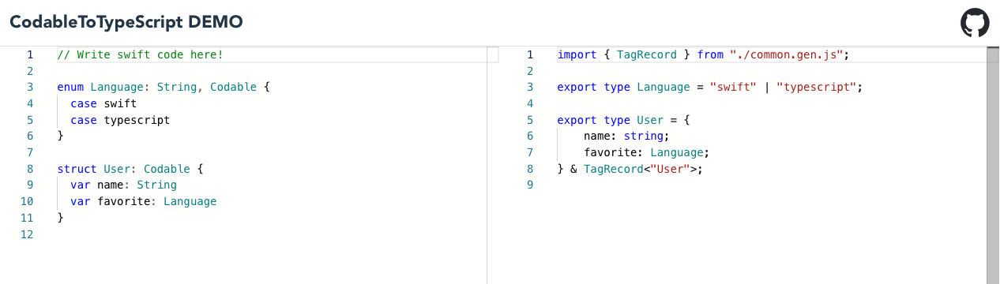

<style>
.codegenbox { 
    display: flex; flex-direction: row; align-items: start; width: 100%; 
}
.codegenbox > .code { 
    flex: 1;
} 
.codegenbox > .arrow {
    padding: 10px; align-self: center;
}
</style>

## わいわいswiftc #39

# Swiftの型をTypeScriptで表す

Twitter @iceman5499

<!-- _footer: 2023年1月20日 -->
<!-- 
Swiftにおけるファントムタイプの意味論がTypeScriptにおいて再現できていない #53
https://github.com/omochi/CodableToTypeScript/issues/53
の内容
-->

---

# あらすじ

- Swiftは良い言語
- いろんなところで使いたい
- Webで良い感じに使うためにはTypeScriptとうまく連携する必要がある
    → Swiftの型をTypeScriptで表したい
    :soon: CodableToTypeScript
    - https://github.com/omochi/CodableToTypeScript
    
---

# 基本的な型の変換

わいわいswiftc #35で紹介しました

<div class=codegenbox>
<div class=code>

```swift
public enum Item: Codable {
    case name(String)
    case email(String)
}
```
</div>
<p class=arrow>→</p>
<div class=code>

```typescript
export type Item = ({
    kind: "name";
    name: { _0: string };
} | {
    kind: "email";
    email: { _0: string };
});
```
</div>
</div>

- switch文で網羅性やType Guards[1]を実現するため、`kind`が追加される様子↑

今回はその延長線の話です。

<!-- _footer: 1: Kotlinではsmart castと呼ばれているやつ -->

--- 

# Swiftの型とTypeScriptの型の違い

- Swiftは**nominal typing**
    - 名前が違えば違う型
- TypeScriptは**structural typing**
    - 名前が違ってても、見た目が同じだったら同じ型
    - 同じでなくても、見た目が十分であればサブタイプ関係が得られる

---

## Swiftでは区別されるけど、TypeScriptだと区別されない例

<div class=codegenbox>
<div class=code>

Swift

```swift
struct User: Codable {
    var id: String
    var name: String
}
struct Pet: Codable {
    var id: String
    var name: String
}

var pet: Pet!
func useUser(_ user: User) {}
// useUser(pet) // コンパイルエラー
```

</div>
<p class=arrow></p>
<div class=code>

TypeScript

```ts
type User = {
    id: string;
    name: string;
};
type Pet = {
    id: string;
    name: string;
};

declare var pet: Pet;
function useUser(user: User) {}
useUser(pet);
// ↑petがUserとして使えてしまう
``` 

</div>
</div>

--- 

# 型に込めたの気持ちが漏れるケース

- Swiftにおけるファントムタイプの例

```swift
struct GenericID<T>: RawRepresentable, Codable { var rawValue: String }
typealias UserID = GenericID<User>
typealias PetID = GenericID<Pet>
```

これをTSに変換した場合・・・
<!-- ここで、GenericIDは正しくrawValueを保持した型に変換されていないが、RawRepresentableに対して特別ルールがあるということにする -->

```ts
type GenericID<T> = string;
type UserID = GenericID<User>; // string
type PetID = GenericID<Pet>; // string

function usePetID(petID: PetID) {}
const userID: UserID = user.id;
usePetID(userID); // OK😅
```

Swiftの型に込めた気持ちがTSに表われてなくて嬉しくない

---

# ファントムタイプを再現したい

TypeScriptでファントムタイプを再現したい場合、いくつかやり方は存在している。

```ts
type UserID = string & {
    User: never;
};
type PetID = string & {
    Pet: never;
};

function useUserID(userID: UserID) {}
declare var petID: PetID;
useUserID(petID); // Property 'User' is missing in type 'PetID'
```

↑実際には存在しないが、型定義の上では存在するようなプロパティを定義する例

---

# ジェネリックな対応

先程のファントムタイプをより一般化し、
`type UserID = GenericID<User>;` と記載できるようにしたい。

```ts
// こういう感じにしたい
type GenericID<T> = string & {
    [Tの名前]: never; 
};
```

---

## 直接やろうとした場合

TypeScriptにはMapped Typeというものがあり、型から別の型のプロパティを宣言することが可能。

```ts
// Mapped Type
type A = "zero" | "one" | "two";
type B<T extends string> = {
    [P in T]: null;
};
type C = B<A>;
// {
//     zero: null;
//     one: null;
//     two: null;
// };
```

---


`T`にメタタグとしてString Literal Typeを結合することで、メタタグをプロパティに生やす。

- Mapped Typeの機能を無理矢理つかって型が持つString Literal Typeからプロパティを宣言

```ts
type User = { ... } & "User";
type GenericID<T extends string> = string & {
    [P in 0 as `${T}`]: never; 
};
type UserID = GenericID<User> // string & { User: never; }
```

---

### 課題

`T`にメタタグとしてString Literal Typeをくっつけると不便が大きい。

```ts
const user: User = {
    ...
} & "User"; // これはできない
const user: User = {
    ...
} as User; // asでキャストはできるけど・・・
```

---

## 型のメタタグを専用プロパティに保持するやり方

プロパティのキーは扱いが難しかったため、値としてメタタグを持たせたい。
- このような方法でもファントムタイプを実現できる

```ts
type UserID = string & {
    $tag?: "User";
};
type PetID = string & {
    $tag?: "Pet";
};

function useUserID(userID: UserID) {}
declare var petID: PetID;
useUserID(petID); // Type '"Pet"' is not assignable to type '"User"'.
```

---

- 一般化を考えた場合

```ts
type User = { ... } & { $tag?: "User" };
type GenericID<T> = string & {
    $tag?: ????
};
type UserID = GenericID<User>;
```

`????`の部分にTのもつ`$tag`の型を埋め込みたい

<!--  
```ts
type TagRecord<T extends string> = {
    $tag?: T;
};
type GenericID<T extends TagRecord<TAG>, TAG extends string = NonNullable<T['$tag']>> = string & {
    $tag?: TAG;
};
```
こういうやり方もできる
-->

---

Conditional Typeとinfer演算子を使って、特定のプロパティが持つ型を取り出せる。

```ts
// Conditional Type
type A<T> = T extends string ? true : false;
type B = A<"aaa">; // true
type C = A<0x0>; // false

// infer
type D<T> = T extends { value: infer I } ? I : never;
type E = D<"aaa">; // never
type F = D<{ value: string }>; // string
```

---

- 値としてメタタグを持たせた場合

```ts
type User = { ... } & { $tag?: "User" };
type GenericID<T> = string &
    T extends { $tag?: infer TAG } 
        ? { $tag?: TAG; }
        : {};
type UserID = GenericID<User>; // string & { $tag?: "User" }

// テスト
type Pet = { ... } & { $tag?: "Pet" };
type PetID = GenericID<Pet>;
function useUserID(userID: UserID) {}
declare var petID: PetID;
useUserID(petID); // Type '"Pet"' is not assignable to type '"User"'.👍
```

`$tag`は値として存在しなくても良いので`User`を自然に生成できる。

---

ちょっと一般化して専用の型を作る。

```ts
type TagRecord<TAG extends string> = { $tag?: TAG };
type NestedTag0<Child> = Child extends TagRecord<infer TAG>
	? { $0?: TAG; }
	: {};
```

全ての型に `TagRecord<T>` をつけ、ジェネリックパラメータを持つ型には追加で`NestegTagX<T>`をつけていけば、nominal typingを再現できる。

```ts
type GenericID<T> = string & TagRecord<"GenericID"> & NestedTag0<T>;
```

---

仮に`User`がジェネリックな型パラを持っていたとしても判別できる！
<!-- これはあくまで一般化による恩恵で、構造的にはGenericIDと同一 -->

```ts
type User<Domain> = {
  id: GenericID<User<Domain>>;
  name: string
} & TagRecord<"User"> & NestedTag0<Domain>;

type Server = {} & TagRecord<"Server">;
type Client = {} & TagRecord<"Client">;

function useServerUser(user: User<Server>) {}
declare var clientUser: User<Client>;
useServerUser(clientUser); 
// ↑ Type '"Client"' is not assignable to type '"Server"'.👍
```

---

ただし微妙な抜け穴もある

```ts
function useServerUserID(id: GenericID<User<Server>>) {}
useServerUserID(clientUser.id); // OK 😢
```

`GenericID<User<Server>>` は `string & { $tag?: "GenericID" } & { $0?: "User" }` であり、`Server`のタグが抜け落ちてしまっている。

→ `TagRecord<T>` の時点で再帰的にTのジェネリックパラメータが持つタグも拾っておく必要がある。

---

## 再帰的にメタタグを拾う

`TagRecord<T>`が`T`のタグを拾うようにしたパターン

```ts
type TagOf<Type> = Type extends { $tag?: infer TAG } ? TAG : never;
type TagRecord0<T extends string> = {
    $tag?: T
};
type TagRecord1<T extends string, C0> = {
    $tag?: T & {
        $arg0?: TagOf<C0>;
    };
};
type TagRecord2<T extends string, C0, C1> = {
    $tag?: T & {
        $arg0?: TagOf<C0>;
        $arg1?: TagOf<C1>;
    };
}; // ...
```

---

```ts
type GenericID<T> = string & TagRecord1<"GenericID", T>;

type User<Domain> = {
  id: GenericID<User<Domain>>;
  name: string
} & TagRecord1<"User", Domain>;

type Server = {} & TagRecord0<"Server">;
type Client = {} & TagRecord0<"Client">;

function useServerUser(user: User<Server>) {}
declare var clientUser: ClientUser;
useServerUser(clientUser); // Error 👍
function useServerUserID(id: GenericID<User<Server>>) {}
useServerUserID(clientUser.id); // Error 👍
```

---

- `TagRecordX`を使うことで型パラメータそれぞれのメタタグが事前に展開され、その展開済みのタグを`TagOf`で拾うことができるようになった

これでかなりいい感じになってきた。

```ts
// 展開するとこう
type ServerUserID = GenericID<User<Server>>;
// string & { $tag?: "GenericID" & { $arg0?: "User" & { $arg0?: "Server" } } }
```

---

## 型パラメータを可変長にする

`TagRecord0`、`TagRecord1`、`TagRecord2` と型パラの数だけ`TagRecord`が必要になってしまうのが微妙なので、これも改善する。
Mapped TypeのTuple Type拡張を組み合わせて、型パラメータを計算する。

```ts
// Mapped TypeのTuple Type拡張
type A = ["zero", "one", "two"];
type B<T extends string[]> = {
    [P in keyof T]: Uppercase<T[P]>;
};
type C = B<A>; // ["ZERO", "ONE", "TWO"];
```

---

- こうなる

```ts
type TagOf<Type> = Type extends { $tag?: infer TAG } ? TAG : never;
type TagRecord<T extends string, Args extends any[] = []> = Args["length"] extends 0
  ? {
    $tag?: T;
  } : {
    $tag?: T & {
      [I in keyof Args]: TagOf<Args[I]>;
    };
  };
type GenericID<T> = string & TagRecord<"GenericID", [T]>;
```

- `Args["length"] extends 0`でタプルが空かどうかを判定できる

```ts
// 展開するとこう
type ServerUserID = GenericID<User<Server>>;
// string & { $tag?: "GenericID" & ["User" & ["Server"]] }
```

---

- Swiftから変換する型全てに`TagRecord`をつけておけば、nominal typingが実現できるようになった
- しかし、Swiftから変換するときにTypeScriptネイティブなジェネリック型に変換されるケースが少なからず存在する

| Swift | TypeScript |
| :---: | :---: |
| `[T]` | `T[]` | 
| `T?` | `T \| null` |
| `[String: T]` | `Map<string, T>` |

<!-- _footer: 今のところDictionaryはKeyがStringなものしか対応していない。 -->

---

これらについては、数が限られるので個別に対応した。

```ts
type TagOf<Type> = [Type] extends [TagRecord<infer TAG>]
    ? TAG
    : null extends Type
        ? "Optional" & [TagOf<Exclude<Type, null>>]
        : Type extends (infer E)[]
            ? "Array" & [TagOf<E>]
            : Type extends Map<infer K, infer V>
                ? "Dictionary" & [K, TagOf<V>]
                : never;
```

`TagOf<User[]>`は `Array & ["User"]`になる

---

# CodableToTypeScriptで何ができるか

---

# CodableToTypeScriptで何ができるか

- SwiftサーバとWebフレームワーク間の型定義
    - Swiftの型に込もった気持ちのまま扱える
    - OpenAPIやgRPCのような専用の型定義言語が主役ではなく、Swiftが主役
- Swiftの実装をWebの世界に持ち込む


---

# CodableToTypeScript on Browser



https://omochi.github.io/CodableToTypeScript/

---

# CodableToTypeScript on Browser

最近のテクが詰まった夢のアプリ

- WebAssemblyによって、CodableToTypeScriptがそのままブラウザ上で動作
    - APIと通信したりしないので爆速
- SwiftSyntaxは最近Swiftで再実装されたので、Wasmで動かせるようになった
- ReactとSwift間のやりとりにはWasmCallableKitを利用
    - WasmCallableKit・・・Swiftの関数やクラスをTSから直接利用できるようにするツール
- SwiftWasm 5.7.2でビルドターゲットの依存管理が正確になった
    - 今まではPluginにmacos用ターゲットが含まれると正しくビルドできなかった

---

# WasmCallableKit

<div class=codegenbox>
<div class=code style="flex: 1.2">

```swift
public enum FenceOrientation: String, Codable {
    case horizontal
    case vertical
}

public struct FencePoint: Codable {
    public var x: Int
    public var y: Int
    public var orientation: FenceOrientation
}

public struct Board: Codable {
    ...
    public var fences: [FencePoint]
}

public class QuoridorGame {
    private var state: ...
    public init() {}

    public func putFence(position: FencePoint) throws { 
        ...
    }
    public func currentBoard() -> Board {
        ...
    }
}
```
</div>
<p class=arrow>→</p>
<div class=code>

クラスをTypsScriptに持ち出せるようになった

```typescript
const game = new QuoridorGame();
game.putFence({
    x: 1, y: 4, orientation: "horizontal"
});
const board = game.currentBoard();
board.fences.map(...);

```
</div>
</div>


<!-- _footer: https://github.com/sidepelican/WasmCallableKit -->

---

# おわり
